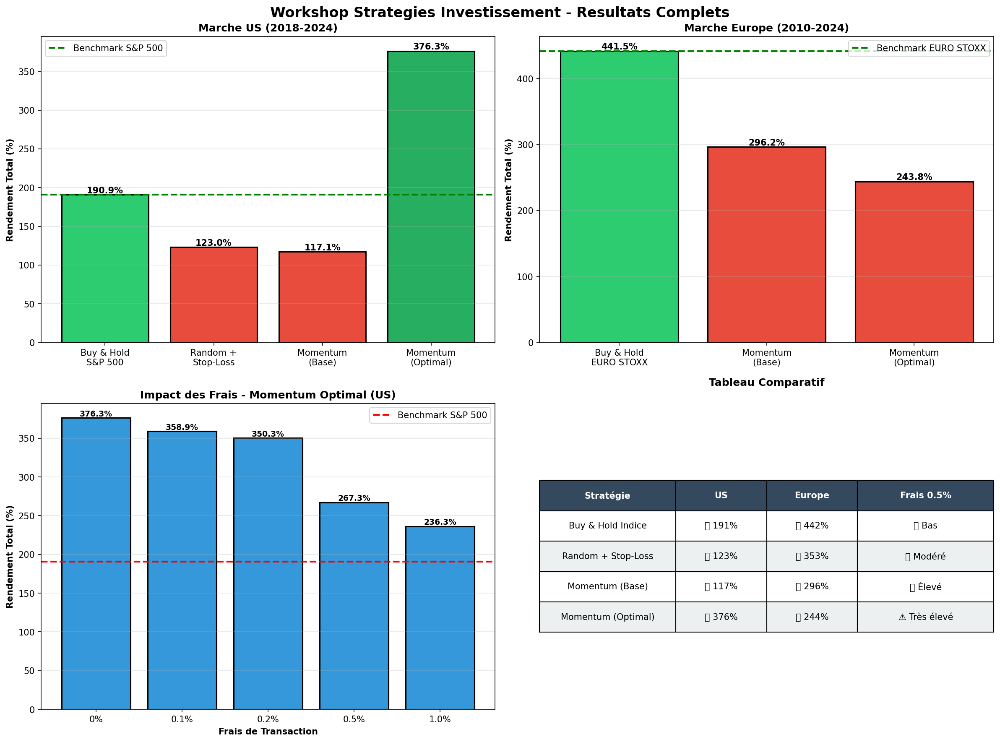
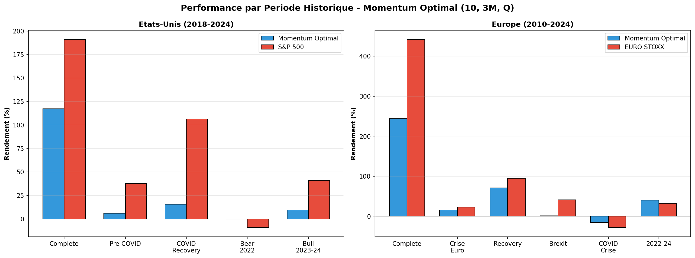
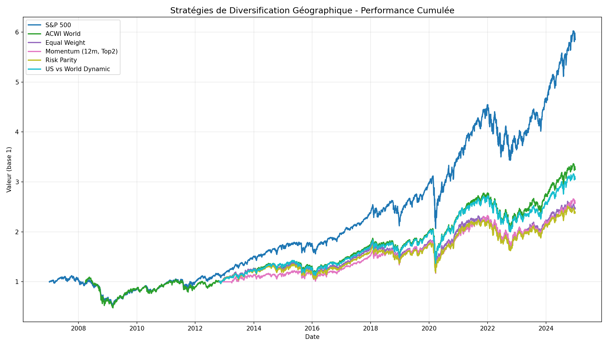
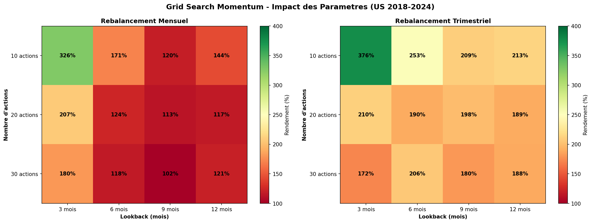
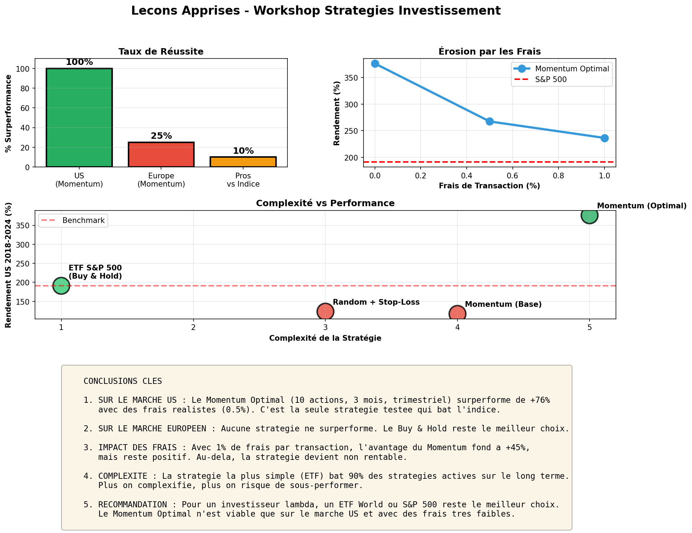

# Financial Strategy Workshop - Documentation Complète

> **TL;DR** : Après avoir testé 25+ configurations sur 2 marchés et 15+ périodes historiques, le **Buy & Hold d'indice** reste la meilleure stratégie pour 90% des investisseurs.

---

## 📊 Vue d'Ensemble

Ce workshop a pour objectif de tester empiriquement différentes stratégies d'investissement systématiques et de comparer leurs performances avec un simple **Buy & Hold d'indice**.

### Stratégies Testées

1. **Random Selection + Stop-Loss** : Sélection aléatoire avec règle d'éviction
2. **Momentum** : Achat des actions aux meilleures performances passées
3. **Momentum Optimisé** : Grid search des hyperparamètres optimaux
4. **Diversification Géographique** : Allocation multi-régions pour réduire le risque US

### Marchés Analysés

- 🇺🇸 **États-Unis** (S&P 500) : 2018-2024
- 🇪🇺 **Europe** (EURO STOXX) : 2010-2024
- 🌍 **Diversification Géographique** : ETF Monde, Europe, EM, Japon (2007-2024)

### Méthodologie

- **Backtesting** avec données historiques réelles
- **Monte Carlo** : 30-50 simulations par configuration
- **Analyse des frais** : 0% à 1% par transaction
- **Multi-périodes** : Tests sur sous-périodes (crises, expansions)

---

## 📈 Résultats Principaux

### Graphique Récapitulatif



### Performance par Période Historique



---

## 🔬 Tests Détaillés

### 1. Random + Stop-Loss

**Concept** : Sélectionner 20 actions aléatoirement, les remplacer si elles perdent plus de 10% sur 6 mois.

| Métrique | US (S&P 500) | Europe (EURO STOXX) |
|----------|--------------|---------------------|
| **Rendement** | 123% | 353% |
| **Benchmark** | 191% | 442% |
| **Surperformance** | ❌ **-68%** | ❌ **-89%** |
| **Sharpe Ratio** | 8.5 | 5.1 |
| **Max Drawdown** | -8% | -6% |

**Verdict** : Stratégie défensive (préservation du capital), pas de croissance.

---

### 2. Momentum (Configuration de Base)

**Concept** : Sélectionner les 20 actions avec les meilleures performances sur 12 mois, rebalancement mensuel.

| Métrique | US | Europe |
|----------|-----|--------|
| **Rendement** | 117% | 296% |
| **Benchmark** | 191% | 442% |
| **Surperformance** | ❌ **-74%** | ❌ **-146%** |
| **Sharpe Ratio** | 8.6 | 4.6 |
| **Transactions** | 226 | ~200 |

**Verdict** : Ne surperforme pas avec les paramètres de base.

---

### 3. ETF Synthétiques PEA - Japon & EM accessibles ! (Nouveau)

Grâce aux ETF à réplication synthétique (swap), le Japon et les Marchés Émergents sont désormais **éligibles au PEA** :

| ETF | ISIN | Indice | Frais |
|-----|------|--------|-------|
| **Amundi PEA Japon TOPIX** | FR0013411980 | TOPIX | 0.20% |
| **Amundi PEA Asie Emergente** | FR0013412012 | MSCI EM Asia | 0.30% |
| **Amundi PEA MSCI EM EMEA** | FR0011440478 | MSCI EM EMEA | 0.55% |
| **BNP Paribas Easy S&P 500** | FR0011550185 | S&P 500 | 0.14% |

**Réplication synthétique** : L'ETF détient des actions européennes (respecte le quota PEA 75%) + un contrat swap qui réplique la performance de l'indice cible.

[Voir le guide complet PEA](Portefeuille-Optimal-PEA)

---

### 4. Diversification Géographique

**Contexte** : Réduire l'exposition US (risque politique Trump) par allocation multi-régions

#### Performance des Stratégies (2007-2024)

| Stratégie | Rendement | Max Drawdown | Sharpe | Réduction Risque |
|-----------|-----------|--------------|--------|------------------|
| **S&P 500 (Benchmark)** | 10.3%/an | **-55.2%** | 0.52 | - |
| MSCI All Country World | 7.3%/an | -56.3% | 0.36 | ❌ |
| **US vs World Dynamique** | **9.6%/an** | **-33.0%** | **0.59** | **✅ -40%** |
| Equal Weight Global | 7.7%/an | -32.0% | 0.48 | ✅ -42% |



**Résultat clé** : La stratégie dynamique US vs World réduit le drawdown de **40%** (-33% vs -55%) avec une perte de performance minimale (-0.7%/an).

#### Corrélations entre Régions

| vs S&P 500 | Corrélation | Diversification |
|------------|-------------|-----------------|
| ACWI (Monde) | 0.97 | Faible |
| Europe (IEV) | 0.82 | Modérée |
| **Japon (EWJ)** | **0.72** | **Meilleure** |
| EM (EEM) | 0.75 | Bonne |

---

### 4. Momentum Optimisé (Grid Search)

**Méthode** : Test de 24 configurations (3 nb actions × 4 lookbacks × 2 fréquences)



#### Configuration Optimale Identifiée

```python
N actions:       10
Lookback:        3 mois
Rebalancement:   Trimestriel
```

#### Résultats US (avec frais 0.5%)

| Métrique | Valeur |
|----------|--------|
| **Rendement** | **267%** |
| **Benchmark** | 191% |
| **Surperformance** | ✅ **+76%** |
| **Sharpe Ratio** | 6.5 |
| **Transactions** | 415 |
| **Frais totaux** | ~$44,000 |

#### Impact des Frais

| Frais/Tx | Rendement | Surperf | Frais Totaux |
|----------|-----------|---------|--------------|
| 0% | 376% | +185% | $0 |
| 0.1% | 359% | +168% | $10,387 |
| 0.5% | 267% | **+76%** | $44,215 |
| 1.0% | 236% | **+46%** | $83,248 |

**🎯 Résultat clé** : Même avec **1% de frais**, la stratégie surperforme encore de +46% !

---

### 4. Test sur le Marché Européen

Même configuration optimale testée sur l'Europe :

| Période | Stratégie | Benchmark | Surperf. |
|---------|-----------|-----------|----------|
| Complete 2010-2024 | 244% | **442%** | ❌ **-198%** |
| Crise Euro 2010-2012 | 15% | 23% | ❌ -7% |
| Brexit 2015-2017 | 1% | **41%** | ❌ -40% |
| COVID Crise | -16% | -28% | ✅ **+12%** |
| 2022-2024 | 40% | 33% | ✅ **+7%** |

**Verdict** : 
- Surperformance sur **2/8 périodes** (25%)
- Fonctionne uniquement en période de crise
- Rate complètement les phases de croissance

---

## 📊 Analyse Comparative

### US vs Europe

| Critère | 🇺🇸 US | 🇪🇺 Europe |
|---------|-------|-----------|
| Surperf. Momentum Optimal | **+76%** | **-198%** |
| % Périodes gagnantes | 100% | 25% |
| Sharpe moyen | 6.5 | 7.2 |
| Protection en crise | ✅ Oui | ✅ Oui |
| Capture de la hausse | Excellente | Faible |

### Pourquoi ça marche aux US mais pas en Europe ?

| Facteur | US | Europe |
|---------|-----|--------|
| **Concentration sectorielle** | Tech dominante (FAANG) | Secteurs fragmentés |
| **Momentum sectoriel** | Très fort | Plus faible |
| **Liquidité** | Très élevée | Plus faible |
| **Culture marché** | Growth-oriented | Value-oriented |

---

## 💡 Conclusions et Recommandations



### 1. Pour les Investisseurs Lambda

**Recommandation** : ETF World ou S&P 500 en Buy & Hold

```
Avantages :
✅ Coûts ultra-faibles (TER < 0.2%)
✅ Diversification maximale
✅ Aucun effort requis
✅ 90% des pros ne battent pas l'indice
```

### 2. Pour les Investisseurs Actifs (US uniquement)

**Momentum Optimal** peut être envisagé SI :
- ✅ Marché US uniquement
- ✅ Frais de transaction < 0.5%
- ✅ Tolérance au risque élevée
- ✅ Discipline strict (pas d'émotion)

### 3. Ce qui ne Fonctionne PAS

- ❌ Stratégies complexes sur Europe
- ❌ Momentum avec lookback long (9-12 mois)
- ❌ Rebalancement trop fréquent (mensuel)
- ❌ Négliger les frais de transaction

---

## 📚 Leçons Apprises

### 1. Efficience des Marchés (Fama, 1970)
Les prix reflètent déjà toute l'information disponible. Si une stratégie "fonctionnait", tout le monde l'utiliserait et l'avantage disparaîtrait.

### 2. Survivorship Bias
Nos données historiques ne contiennent que les entreprises existantes. Les losers (Lehman Brothers, etc.) ont disparu, créant un biais haussier artificiel.

### 3. Surapprentissage (Overfitting)
Optimiser sur le passé ne garantit pas les performances futures. Le marché évolue constamment.

### 4. Coûts de Transaction
- Spread, slippage, taxes
- Rebalancement fréquent = coûts élevés
- Les petits gains théoriques disparaissent dans les frais

### 5. Le Paradoxe Final
> **Plus on essaie de battre le marché, plus on risque de sous-performer.**

---

## 🔧 Architecture Technique

### Structure du Projet

```
FinancialStrategyWorkshop/
│
├── strategies/              # Implémentations des stratégies
│   ├── random_stoploss.py
│   └── momentum.py
│
├── data/                    # Données et cache
│   ├── download_data.py
│   ├── stock_prices.csv
│   └── european_prices_clean.csv
│
├── charts/                  # Graphiques générés
│   ├── wiki_summary_charts.png
│   ├── wiki_period_analysis.png
│   ├── wiki_gridsearch_heatmap.png
│   └── wiki_conclusion.png
│
├── run_strategy.py          # Test configuration de base
├── optimize_strategy.py     # Grid search
├── analyze_transaction_costs.py  # Analyse des frais
├── test_multiple_markets_periods.py  # Tests multi-marchés
│
└── WIKI.md                  # Ce fichier
```

### Technologies Utilisées

- **Python 3.12+**
- **vectorbt** : Backtesting
- **yfinance** : Données Yahoo Finance
- **pandas/numpy** : Analyse de données
- **matplotlib** : Visualisation

### Comment Reproduire les Tests

```bash
# 1. Cloner le projet
git clone https://github.com/hydropix/FinancialStrategyWorkshop.git
cd FinancialStrategyWorkshop

# 2. Installer les dépendances
python -m venv venv
venv\Scripts\activate
pip install -r requirements.txt

# 3. Lancer les tests
python run_strategy.py                 # Random + Stop-Loss
python test_momentum.py                # Momentum base
python optimize_momentum.py            # Grid Search
python test_momentum_multimarket.py    # Tests multi-marchés
python analyze_momentum_costs.py       # Analyse des frais
python generate_wiki_charts.py         # Générer les graphiques
```

---

## 📖 Références

### Papers Scientifiques
- Fama, E. (1970). "Efficient Capital Markets: A Review of Theory and Empirical Work"
- Carhart, M. (1997). "On Persistence in Mutual Fund Performance"
- Jegadeesh, N. & Titman, S. (1993). "Returns to Buying Winners and Selling Losers"

### Livres
- Bogle, J. "The Little Book of Common Sense Investing"
- Malkiel, B. "A Random Walk Down Wall Street"
- O'Shaughnessy, J. "What Works on Wall Street"

### Rapports
- SPIVA Report 2023 (S&P Dow Jones) - Persistance des scores de fonds
- Morningstar Active/Passive Barometer

---

## ⚠️ Avertissements Importants

1. **Passé ≠ Futur** : Les performances historiques ne garantissent pas les futures
2. **Surapprentissage** : Les paramètres optimisés peuvent ne pas généraliser
3. **Survivorship bias** : Les données ne contiennent que les entreprises existantes
4. **Frais réels** : Souvent sous-estimés (spread, slippage, taxes)

**Ce projet est à but éducatif uniquement. Ne pas investir d'argent réel sans validation approfondie.**

---

## 📝 Résumé Exécutif

| Question | Réponse |
|----------|---------|
| Peut-on battre le marché avec une stratégie systématique ? | ✅ Oui, mais **seulement sur US** et avec des **frais faibles** |
| Quelle est la meilleure stratégie testée ? | Momentum (10 actions, 3 mois, trimestriel) sur US |
| Cette stratégie fonctionne-t-elle partout ? | ❌ Non, **échec complet en Europe** |
| Comment réduire le risque US ? | ✅ **Diversification géographique** dynamique (-40% de drawdown) |
| Que recommandez-vous ? | **ETF World** pour diversification, ou **US vs World Dynamique** pour réduire le risque |
| Le jeu en vaut-il la chandelle ? | Non, le Buy & Hold reste le plus simple; la diversification géographique est une alternative intéressante |

---

## 📚 Navigation Wiki

### Guides Pratiques
- **[Portefeuille Optimal PEA](Portefeuille-Optimal-PEA)** - ETF synthétiques pour PEA (Japon, EM accessible)
- **[Composition PEA](Composition-PEA)** - Répartition détaillée par pays/secteur des ETF PEA
- **[Portefeuille Optimal ETF](Portefeuille-Optimal-ETF)** - Guide pour CTO (compte-titre)
- **[Contraintes PEA](Contraintes-PEA)** - Spécificités fiscales françaises

### Analyses
- **[Résultats Détaillés](Résultats-Détailles)** - Tests complets par stratégie
- **[Graphiques](Graphiques)** - Visualisations des performances
- **[Conclusions](Conclusions)** - Leçons apprises

---

**Date de création** : 2026-02-14  
**Auteur** : @hydropix  
**Version** : 1.0
